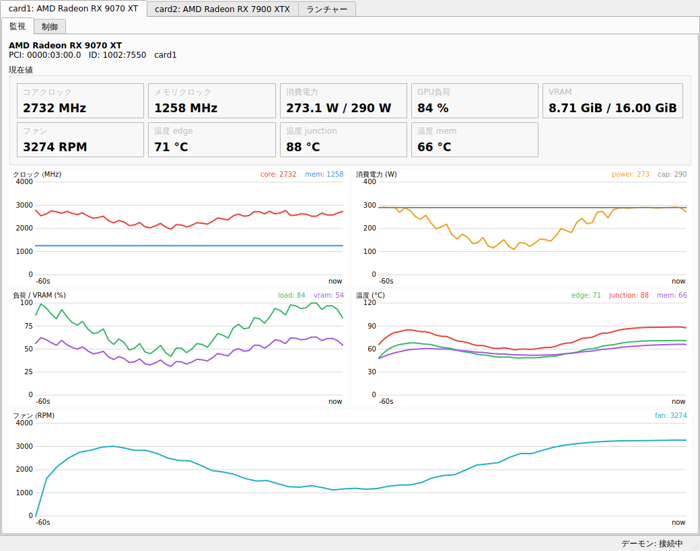
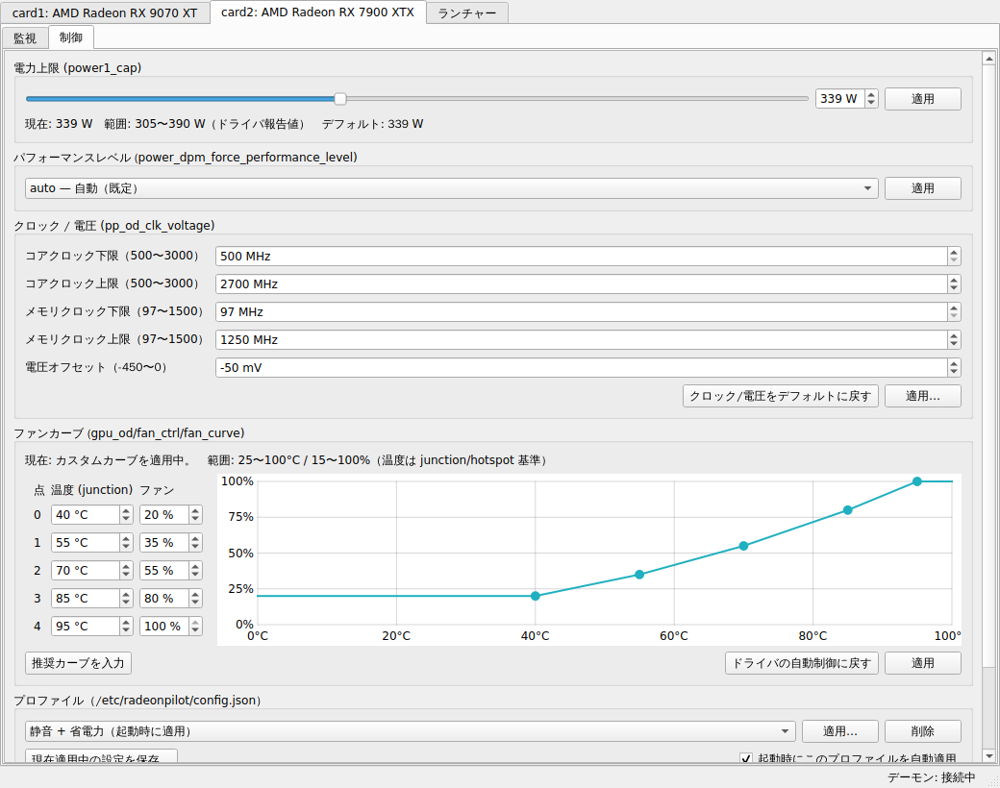
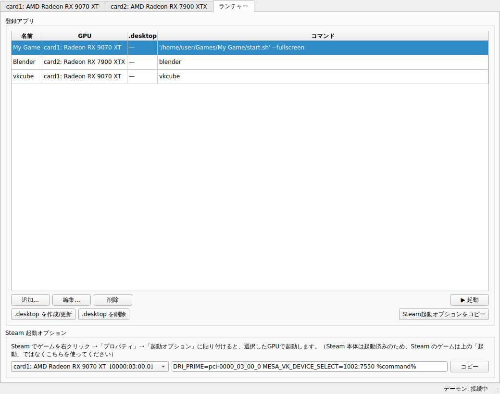
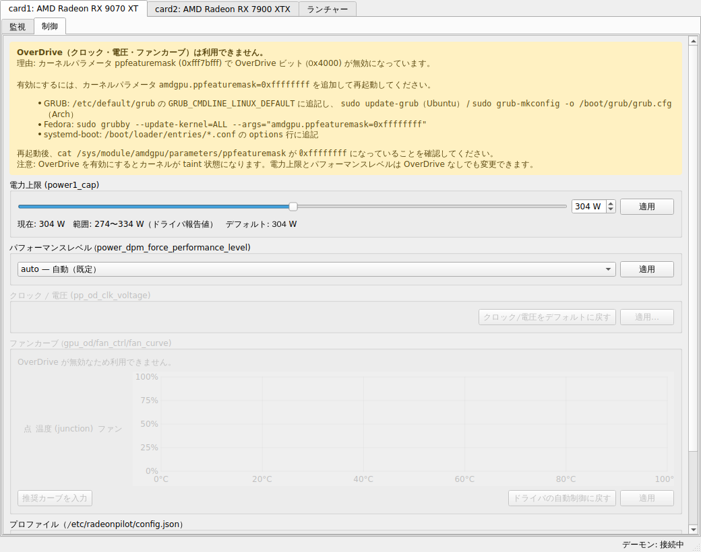

# RadeonPilot

AMD Radeon RDNA3 / RDNA4 GPU 向けの Linux 用 GUI 管理ツール（Python / PySide6）。
監視・電力上限・クロック/電圧・ファンカーブ・プロファイル、そして「どの GPU でアプリを起動するか」をまとめて扱えます。

> ⚠️ **実機での検証はまだ行われていません。** 開発はエミュレーター（RX 9070 XT / RX 7900 XTX の sysfs を模擬）上で行っています。
> 問題があれば Issue で報告してください。

## スクリーンショット

※ いずれもエミュレーター上での表示です（実機の値ではありません）。

| 監視 | 制御 |
|---|---|
|  |  |
| **GPU切り替えランチャー** | **OverDrive 無効時** |
|  |  |

## 機能

### 監視（1秒間隔、直近60秒のグラフ）
- コア/メモリクロック（`pp_dpm_sclk` / `pp_dpm_mclk`）
- 消費電力（hwmon `power1_average`、なければ `power1_input`）と電力上限
- GPU 負荷（`gpu_busy_percent`）、VRAM 使用量/総量
- ファン回転数（`fan1_input`）、温度（edge / junction / mem）
- 複数 GPU はタブで切り替え（PCI アドレス・製品名・デバイス ID を表示）

### 制御（特権デーモン経由）
- 電力上限（`power1_cap`、`power1_cap_min`〜`max` の範囲内のみ）
- パフォーマンスレベル（`power_dpm_force_performance_level`）
- クロック / 電圧（`pp_od_clk_voltage`、ドライバが報告する `OD_RANGE` の範囲内のみ）
  - RDNA3: コアクロック下限/上限、メモリクロック下限/上限、電圧オフセット
  - RDNA4: コアクロック**オフセット**、メモリクロック下限/上限、電圧オフセット
- ファンカーブ（`gpu_od/fan_ctrl/fan_curve`、junction 温度基準、エディタとプレビュー付き）
- 「デフォルトに戻す」（項目別 / すべて）
- プロファイル: 「現在適用中の設定」を名前を付けて保存し、GPU ごとに 1 つを起動時に自動適用（`/etc/radeonpilot/config.json`）
- OverDrive が無効（`ppfeaturemask`）な場合は理由と有効化方法を表示し、クロック/電圧/ファンカーブの UI をグレーアウト

### GPU 切り替えランチャー
- アプリを登録して、実行する GPU を選んで起動（`DRI_PRIME=pci-XXXX_XX_XX_X` と `MESA_VK_DEVICE_SELECT=vendor:device` を設定）
- Steam 用の「起動オプションに貼る文字列」をコピー（例: `DRI_PRIME=pci-0000_03_00_0 MESA_VK_DEVICE_SELECT=1002:7550 %command%`）
- 登録アプリごとに GPU 指定付きの `.desktop` を `~/.local/share/applications/` に生成/削除

## 動作要件

- AMD Radeon RX 7000 シリーズ（RDNA3）/ RX 9000 シリーズ（RDNA4）、`amdgpu` ドライバ
- Linux カーネル: RDNA3 の OverDrive・ファンカーブは 6.7 以降。RDNA4 はそれに対応したより新しいカーネル（目安: 6.14 以降）
- Python 3.11 以上、systemd
- Arch 系 / Fedora 系 / Ubuntu・Debian 系（Ubuntu は 24.04 以降。22.04 は Python 3.10 のため非対応）

## インストール

```bash
git clone https://github.com/gomaes/radeonpilot.git
cd radeonpilot
./install.sh          # sudo で自動的に再実行されます
```

インストール後、**一度ログアウトして再ログイン**してください（`radeonpilot` グループへの追加を反映するため）。
アプリメニューの「RadeonPilot」、または端末で `radeonpilot` で起動します。

`install.sh` が行うこと:

| 内容 | 場所 |
|---|---|
| 依存パッケージのインストール（pacman / dnf / apt を自動判別） | — |
| プログラム本体と venv（PySide6） | `/opt/radeonpilot` |
| systemd サービスの登録・有効化・起動 | `/etc/systemd/system/radeonpilot-daemon.service` |
| `radeonpilot` グループ作成と実行ユーザーの追加 | — |
| デスクトップエントリとアイコン | `/usr/share/applications/radeonpilot.desktop`、`/usr/share/icons/hicolor/scalable/apps/radeonpilot.svg` |
| 起動スクリプト | `/usr/local/bin/radeonpilot` |
| 設定ディレクトリ | `/etc/radeonpilot` |

オプション: `--user NAME`（グループに追加するユーザー）、`--no-deps`（パッケージのインストールを省略）、`--yes`（確認なし）

## OverDrive（クロック・電圧・ファンカーブ）の有効化

カーネルの既定では OverDrive が無効です。カーネルパラメータに `amdgpu.ppfeaturemask=0xffffffff` を追加して再起動してください。

- **GRUB（Ubuntu/Debian）**: `/etc/default/grub` の `GRUB_CMDLINE_LINUX_DEFAULT` に追記 → `sudo update-grub`
- **GRUB（Arch）**: 同上 → `sudo grub-mkconfig -o /boot/grub/grub.cfg`
- **Fedora**: `sudo grubby --update-kernel=ALL --args="amdgpu.ppfeaturemask=0xffffffff"`
- **systemd-boot**: `/boot/loader/entries/*.conf` の `options` 行に追記

確認: `cat /sys/module/amdgpu/parameters/ppfeaturemask` が `0xffffffff` になっていれば有効です。
（OverDrive ビットは `0x4000` です。他の機能ビットを変えたくない場合は、現在値に `0x4000` を OR した値を指定してください。）
電力上限とパフォーマンスレベルは OverDrive なしでも変更できます。

## 安全設計

- GUI は一般ユーザー権限で動作し、sysfs を**読むだけ**です。書き込みはすべて root のデーモンが行います。
- デーモンは書き込みのたびに**その時点でドライバが報告している範囲**を読み直して検証し、範囲外・不正な値は何も書き込まずに拒否します。プロファイルは全項目を先に検証し、1 つでも不正なら何も書き込みません。
- 書き込み後に値を読み戻して照合し、**書き込みエラーや不一致の場合は該当項目を自動でドライバのデフォルトに戻します**（プロファイル適用時は、そのプロファイルが触れた項目すべて）。
- クロック・電圧の変更、およびそれを含むプロファイルの適用・起動時自動適用の設定には確認ダイアログが出ます。
- デーモンが書き込めるのは `power1_cap`、`power_dpm_force_performance_level`、`pp_od_clk_voltage`、`fan_curve` の 4 属性だけで、GPU は PCI アドレスで指定されます（パスはクライアントから受け取りません）。
- ソケット `/run/radeonpilot.sock` は `root:radeonpilot 0660`。さらに接続元の UID を `SO_PEERCRED` で確認します。
- 起動時自動適用は、保存時と同じ GPU（デバイス ID）が同じ PCI アドレスにある場合だけ行います。
- 不安定な設定で困った場合: `sudo systemctl disable --now radeonpilot-daemon` で自動適用を止め、再起動すればドライバのデフォルトに戻ります。

## アンインストール

```bash
./uninstall.sh        # または /opt/radeonpilot/uninstall.sh
```

サービスの停止・無効化、GPU 設定のデフォルトへのリセット、上記ファイル・グループの削除を行います。
`--keep-config` で `/etc/radeonpilot` を残し、`--purge-user-data` でランチャーの登録（`~/.config/radeonpilot`）と生成した `.desktop` も削除します。

## 既知の制限

- **実機で未検証です。** sysfs の書式・挙動はカーネルのソースに基づいてエミュレートしていますが、カーネルのバージョンやボードによって差がある可能性があります。
- 電圧は**オフセットのみ**です（RDNA3/RDNA4 のドライバは V/F カーブの直接編集を公開していません）。RDNA4 のコアクロックは上限ではなくオフセットで指定します。
- 各範囲はドライバの報告値です。範囲内であっても安定動作は保証されません。
- サスペンドからの復帰や GPU リセットで設定が失われることがあります。その場合はプロファイルの「適用」で再適用してください（自動再適用は未対応）。
- ファンカーブの点数と温度基準（junction/hotspot）はドライバに依存します。ゼロ RPM などのその他の `fan_ctrl` 項目は未対応です。
- `MESA_VK_DEVICE_SELECT` は `vendor:device` 形式のため、**同じ型番の GPU が 2 枚ある場合 Vulkan では区別できません**（OpenGL は `DRI_PRIME` の PCI 指定で区別されます）。
- Steam のゲームは Steam 本体の環境で起動するため、ランチャーの「起動」ではなく起動オプションを使ってください。
- ランチャーに表示されるのは `amdgpu` で動作している GPU だけです。
- プロファイルはシステム全体で共有です（`radeonpilot` グループの全ユーザーが変更できます）。
- OverDrive を有効にするとカーネルが taint 状態になります。

## 開発

```bash
python3 -m venv .venv
.venv/bin/pip install -r requirements.txt pytest
.venv/bin/python -m pytest              # テスト（GUI テストはオフスクリーンで実行）
.venv/bin/python -m radeonpilot --dump  # 検出結果と現在値を端末に表示
```

### エミュレーター（GPU なしで全機能を試す）

```bash
scripts/run-emulated.sh           # RX 9070 XT + RX 7900 XTX を模擬してデーモンと GUI を起動
scripts/run-emulated.sh --no-od   # OverDrive 無効（ppfeaturemask 既定値）の状態
```

一時ディレクトリに偽の sysfs を作り、デーモンは `--emulate` で起動します（本物の `/sys` には一切触れません）。
エミュレーターはドライバと同じコマンド（`s`/`m`/`vo`/`c`/`r` など）と範囲チェックを実装し、負荷・温度・ファン・電力のシミュレーションも行います。
`RADEONPILOT_EMU_FAIL=pp_od_clk_voltage:c` のように指定すると書き込み失敗を注入でき、自動リセットの動作を確認できます。
スクリーンショットは `QT_QPA_PLATFORM=offscreen python scripts/screenshots.py docs/screenshots` で再生成できます。

### 構成

```
radeonpilot/
  sysfs.py        GPU 検出と監視値の読み取り（読み取り専用）
  control.py      制御属性の解析・OverDrive 判定・要求の検証（GUI とデーモンで共用）
  protocol.py     GUI⇔デーモン間プロトコル（1 行 1 JSON）とクライアント
  launcher.py     GPU 指定起動・Steam 起動オプション・.desktop 生成
  emulator.py     開発用の sysfs エミュレーター
  daemon/         特権デーモン（server / controller / backend / profiles）
  gui/            PySide6 GUI
packaging/        systemd ユニット、デスクトップエントリ
```

プロトコル例:

```json
{"id": 1, "cmd": "set_power_cap", "params": {"gpu": "0000:03:00.0", "watts": 280}}
{"id": 1, "ok": true, "result": {"power": {"current_w": 280.0, ...}, ...}}
{"id": 2, "ok": false, "kind": "validation", "error": "電力上限 400 W はドライバの報告範囲 274〜334 W の外です"}
```

## ライセンス

MIT
